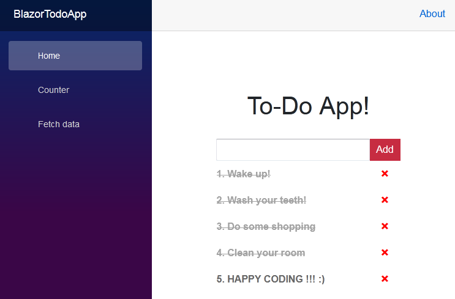

# Blazor-ToDo
To-Do App written in Blazor

<p align="center"></p>

<h1 align="center">
    <strong>Blazor-ToDo</strong>
</h1>
<h3 align="center">
    TODO App written in Blazor
</h3>

<p align="left"></p>

### Features

* *Input field to add todo*
* *List of todos*
* *Todos can be checked and unchecked for 'completed' and deleted*

### Tools needed
* VSCode https://code.visualstudio.com/
* .NET https://dotnet.microsoft.com/
* Blazor Templates https://docs.microsoft.com/en-us/aspnet/core/blazor/tooling?view=aspnetcore-5.0&pivots=windows

### Console commands
To add blazor templates
```
dotnet new -i Microsoft.AspNetCore.Blazor.Templates::3.0.0-preview9.19465.2
```

Creating blazor app with 'blazorwasm' template and named 'BlazortodoApp'
```
dotnet new blazorwasm --name BlazorTodoApp
```

To build and run solution(Ctrl + C to stop server) 
```
dotnet run
```

For server to follow changes
```
dotnet watch run
```

### Blazor
https://dotnet.microsoft.com/apps/aspnet/web-apps/blazor
Blazor is a client-side UI framework from the ASP.NET team. Its big selling point is the ability to write rich web UI experiences using HTML, CSS, and C# instead of JavaScript—something a lot of developers have been dreaming of.

The name **Blazor** is a combination/mutation of the words Browser and Razor (the .NET HTML view generating engine).

# HAPPY CODING !!! :)
